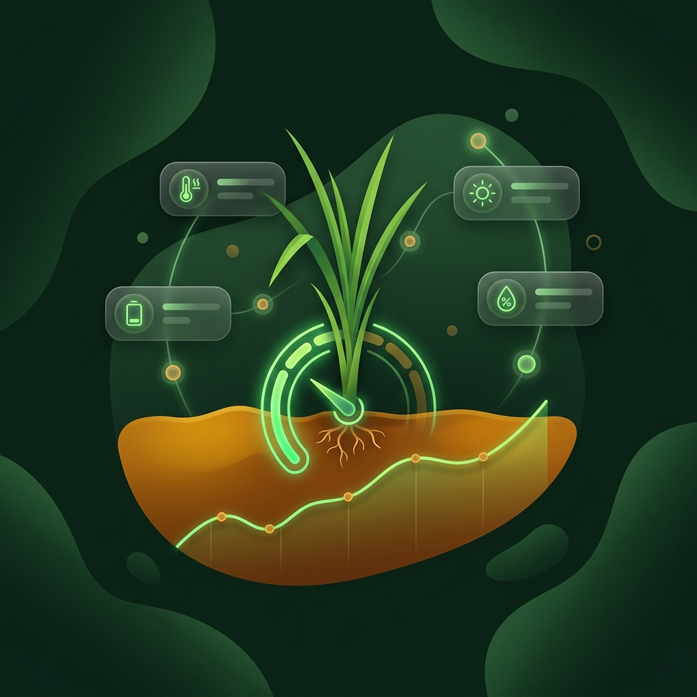

<p align="center">
  
</p>

<h1 align="center">BathariSri: Sistem Informasi Manajemen Pertanian Cerdas</h1>

<p align="center">
  <strong>Aplikasi web modern untuk membantu petani mengelola lahan, mendeteksi penyakit tanaman, memprediksi hasil panen, dan mendapatkan rekomendasi pupuk secara cerdas.</strong>
</p>

<p align="center">
  
  
  
</p>

---

## ✨ Fitur Utama

- 🌿 **Manajemen Lahan & Penjadwalan Tanam**: Kelola data lahan pertanian dan pantau jadwal tanam secara real-time.
- 🔍 **AI Disease Diagnosis (Pemindai Penyakit AI)**: Deteksi penyakit pada daun tanaman secara instan menggunakan teknologi _Image Recognition_.
- 🌾 **Prediksi Panen Cerdas (Smart Harvest)**: Estimasi hasil panen berdasarkan algoritma Sistem Pendukung Keputusan (SPK) dan data historis.
- 🧪 **Rekomendasi Pupuk (Smart Nursery)**: Dapatkan rekomendasi jenis dan dosis pupuk yang paling optimal untuk varietas tanaman yang dipilih.
- ♻️ **Manajemen Limbah Pertanian (Smart Waste)**: Rekomendasi pengelolaan dan pemanfaatan limbah sisa panen untuk memberikan nilai tambah.
- 📰 **Portal Artikel Edukasi**: Kumpulan artikel dan panduan praktis seputar agrikultur modern.

## 🛠️ Teknologi yang Digunakan

- **Backend**: Laravel 11, PHP 8.3+
- **Frontend**: React.js, Inertia.js, TailwindCSS, Vite
- **Database**: SQLite (Default) / MySQL
- **Lainnya**: Sistem autentikasi, SPK Algorithms

## 🚀 Panduan Instalasi (Local Development)

Ikuti langkah-langkah di bawah ini untuk menjalankan project BathariSri di environment lokal (komputer) Anda.

### Prasyarat Sistem
Pastikan perangkat Anda sudah terinstal:
- PHP >= 8.3 (dengan ekstensi `ext-gd` diaktifkan)
- Node.js & NPM
- Composer

### Langkah Instalasi

1. **Clone repository ini**
   ```bash
   git clone https://github.com/navyahmad/BathariSri.git
   cd BathariSri
   ```

2. **Install Dependensi Backend (PHP)**
   ```bash
   composer install --ignore-platform-req=php
   ```

3. **Install Dependensi Frontend (Node.js)**
   ```bash
   npm install --legacy-peer-deps
   ```

4. **Setup Environment Configuration**
   ```bash
   cp .env.example .env
   php artisan key:generate
   ```

5. **Setup Database & Migrasi**
   ```bash
   php artisan migrate
   ```
   *(Pilih **Yes** jika ditanya untuk membuat file `database.sqlite` pertama kali)*

6. **Jalankan Aplikasi**
   Jalankan server backend dan frontend secara bersamaan menggunakan perintah:
   ```bash
   composer run dev
   ```
   *(Jika perintah di atas bermasalah, Anda bisa menjalankannya di dua terminal terpisah: `php artisan serve` dan `npm run dev`)*

Aplikasi sekarang dapat diakses di browser melalui: **`http://localhost:8000`**

## 📸 Tampilan Aplikasi

| Fitur Utama | Smart Nursery | Smart Waste |
|:---:|:---:|:---:|
|  |  |  |

*(Gambar di atas adalah ilustrasi fitur yang tersedia di dalam aplikasi).*

## 🤝 Berkontribusi
Kami sangat terbuka dengan kontribusi! Jika Anda ingin menambahkan fitur, memperbaiki bug, atau meningkatkan kode, silakan:
1. Lakukan *Fork* pada repository ini
2. Buat branch fitur Anda (`git checkout -b fitur-baru-keren`)
3. Commit perubahan Anda (`git commit -m 'Menambahkan fitur keren'`)
4. Push ke branch (`git push origin fitur-baru-keren`)
5. Buka sebuah *Pull Request*

## 📄 Lisensi
Project ini bersifat open-source dan berada di bawah lisensi [MIT](https://opensource.org/licenses/MIT).
